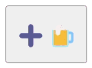
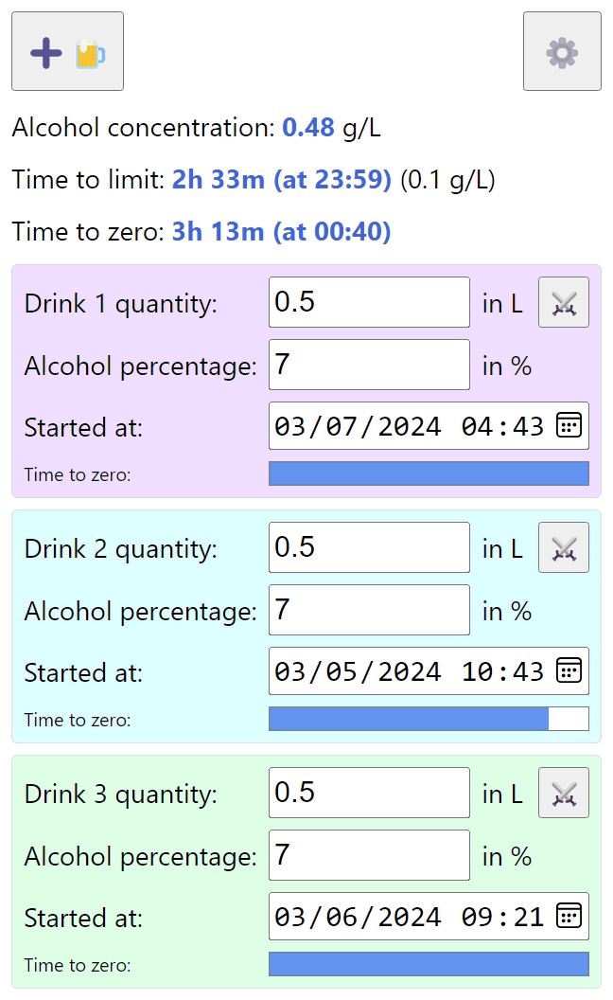

# Overview

This project is a web-based blood alcohol content calculator.

Most of information needed to understand the (easy) math can be found here: https://en.wikipedia.org/wiki/Blood_alcohol_content

## Web application

The web application can be found here: https://tanukisharp.github.io/blood-alcohol-content

## How to run

When working locally for development purpose, just spawn a local web server where the `index.js` is located and open a browser to the hosting address and port.

## How to use

### Settings

The first thing to do is to do a bit of setup. For that, click on the settings button.

Then set your `Body weight`, and your `Rho factor`. The women average is 0.58 and the men average is 0.71, as indicated on the settings page.

As for the `Alcohol elimination rate`, you can let the default value, unless you know what you are doing.

You can also set the `Driving limit` to the regulation value where you drive, but feel free to set it lower if you want.

### Main page

Then add a drink by clicking on the following button:

A drink entry appears below. Set the `Drink quantity`, in liters, and the `Alcohol percentage` in percentage of alcohol contained in the drink.

When a drink is added, the `Started at` date and time are automatically set to now, but you can tweak it if you started to drink before entering values.

Click on the crossed swords button to remove a drink.

On a drink entry, the `Time to zero` is the progression of the alcohol elimination. When the bar is full, the alcohol contained in the drink is completely eliminated by your body, and the entry turns green. At this moment, you can remove it, because it does not affect your alcohol concentration anymore.

Note that a drink with the `Started at` value set in the future turns purple, and is not taken into account to compute your alcohol concentration.

An effective drink has a blue background.

At the top of the page, there are three main textual indicators and hereafter are their descriptions.

`Alcohol concentration`

This represents the amount of pure alcohol in your blood at the moment, in grams of pure alcohol per liter of blood. Of course this is not entirely true, because people drink overtime, and even if you drink bottoms up, it takes a bit of time for alcohol to be absorbed, so this value makes more sense in the long run.

`Time to limit`

This represents the time until your alcohol concentration reaches the `Driving limit` you have set in the settings page. In short, this tells you when you can drive.

The driving limit value set in the settings page is indicated in parentheses beside the `Time to limit` value.

Note that if you set this limit to zero or lower, the `Time to limit` indicator disappears from the page.

`Time to zero`

This represents the time until your alcohol concentration reaches zero grams of alcohol per liter of blood. In other words, this is when your body fully eliminated all the alcohol you have drunk.

At this time, all the drink entries below should be green, and you can remove them all and drive safely.

Hereafter is an example of the main page:

