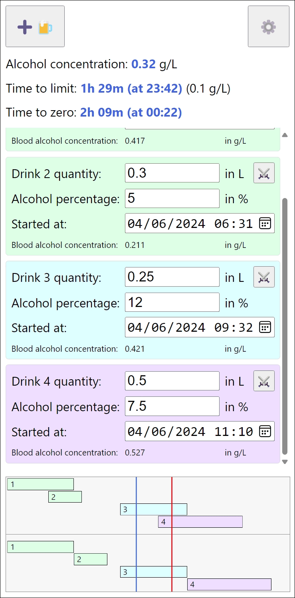

# Overview

This project is a web-based blood alcohol content calculator.

Most of the information needed to understand the (easy) math can be found here: https://en.wikipedia.org/wiki/Blood_alcohol_content

⚠️ Please have a look at the warning section at the end of this document.

## Web application

The web application can be found here: https://tanukisharp.github.io/blood-alcohol-content

## How to run (for developers)

When working locally for development purpose, just spawn a local web server where the `index.html` file is located and open a browser to the hosting address and port.

## How to use (for users)

### Settings

The first thing to do is to do a bit of setup. For that, click on the settings button. (⚙️)

Then set your `Body weight`, and your `Rho factor`. The women Rho factor average is 0.58 L/kg and the men Rho factor average is 0.71 L/Kg, as indicated on the settings page.

As for the `Alcohol elimination rate`, you can let the default value (0.148 g/L/hour), unless you know what you are doing.

You can also set the `Driving limit` to the regulation value where you drive, but feel free to set it lower if you want.

Your settings are stored in the browser's local storage, so if you refresh the page or close it and reopen it later, your settings remain, but if you use another browser or uninstall the browser and reinstall it, or clean it's local storage data, you will have to setup the application again.

### Main page

Add a drink by clicking on the add drink (➕🍺) button.

A drink entry appears below. Set the `Drink quantity`, in liters, and the `Alcohol percentage` in percentage of alcohol contained in the drink.

When a drink is added, the `Started at` date and time are automatically set to now, but you can tweak it if you started to drink before entering values.

Click on the crossed swords (⚔️) button to remove a drink. If a drink is still effective when you try to remove it, a confirmation box appears.

Note that a drink with the `Started at` value set in the future turns purple, and is not taken into account to compute your alcohol concentration.

An effective drink has a blue background. A drink that is fully eliminated turns green, and you can delete it without confirmation.

Also note that drink data is stored in the browser's local storage alongside your settings, so this data remain if you refresh the page or close and reopen your browser.

At the top of the page, there are three main textual indicators and hereafter are their descriptions.

`Alcohol concentration`

This represents the amount of pure alcohol in your blood at the moment, in grams of pure alcohol per liter of blood. Of course this is not entirely true, because people drink overtime, and even if you drink bottoms up, it takes a bit of time for alcohol to be absorbed, so this value makes more sense in the long run.

`Time to limit`

This represents the time until your alcohol concentration reaches the `Driving limit` you have set in the settings page. In short, this tells you when you can drive.

The driving limit value set in the settings page is indicated in parentheses beside the `Time to limit` value.

Note that if you set this limit to zero or lower, the `Time to limit` indicator disappears from the page.

`Time to zero`

This represents the time until your alcohol concentration reaches zero grams of alcohol per liter of blood. In other words, this is when your body fully eliminated all the alcohol you have drunk.

At this time, all the drink entries below should be green, and you can remove them all and drive safely.

Hereafter is an example of the main page:

The timeline at the bottom of the application shows your drinks, with the same color codes as the drink entries above.

The blue vertical line represents the current time, the red vertical line represents the time to limit. The latter is hidden when `Driving limit` is set to zero or lower in the settings page.

In the top part of the timeline, you can see the drinks entered with their respective `Started at` time. The length of the bar that represent drinks is the amount of time they take to be eliminated from your body.

The bottom part of the timeline shows the drinks as your body will really eliminate them, one at a time, so when two drinks overlap, the next one is lined up after the previous one. In this case, the drinks are "connected" and the previous cannot be deleted even if it seams to be eliminated (the blue vertical bar indicating the current time is beyond the end of the drink). In this case, you should see the previous drink in blue color too, meaning it is still effective, or more precisely, it still affects your blood alcohol concentration, and if you remove it, the concentration computation becomes wrong.

## ⚠️ Warning ⚠️

Remember that this application and computations behind are for indication purpose and cannot be in anyway perfectly accurate.

Drive carefully, and simply avoid driving after drinking.
